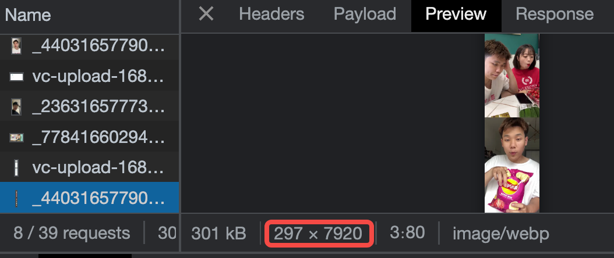

Speaking of images and videos, we often use `img/video` to preview them. However, there are more ways to do this. Today we will introduce some new preview techniques based on frames, such as frame-based video preview, drawing continuous frames over a time, and extract any frame of a gif image.

<!--more-->


## Preview video using long frames
To play a video, we usually use `<video>` tag. However, when we have a page containing hundreds of videos, performance may be a matter if we use `<video>` tag.


In our case, the `div` shows a cover by default. When we move the cursor on it, the `div` shows the current frame by calculating the elapsed time based on cursor's offset. Therefore, when we move quickly, the `div` looks like playing a video.


How to implement this? The initial attempt is to embed a `<video>` tag and set the `currentTime`. Well, it seems a little heavy. Maybe we don't need a real `video`. 

Instead, we use a list of frames extracted from the original video to simulate the play. For example, each frame is `100px*150px` and there are 10 frames in total, so the final image is `100px*1500px`. Wait, why do we stitch the frames vertically? Remember, the screen shows picture by scanning from the left to right and from top to bottom. If the width is too long, it will take much time to render the next line.




```js
function onMouseEnter() {
  if (props.disableLongPicture) return
  
  // download the long image only when mouse enter
  preloadThumbnail()
  
  hasEntered.value = true
}
function onMouseLeave() {
  hasEntered.value = false
}
function onMouseMove(e) {
  if (props.disableLongPicture || !frameDone.value) return

  // threshold = 1      
  const ratio = (e.pageX - wrapLeft + 1) / wrapWidth.value
  const offsetNum = Math.min(props.frameCount - 1, Math.max(0, Math.ceil(ratio * props.frameCount)))
  framePositionStyle.value = {
    'background-position': `0 ${-1 * offsetNum * heightPerFrame.value}px`
  }
  lineStyle.value = {
    left: ratio * wrapWidth.value + 'px',
  }
  currentTime.value = Math.min(duration.value,  Math.max(0, ratio * duration.value))
}
```

## Preview any frame of a gif

工作中遇到一个需求，GIF 默认显示第一帧画面，`hover` 的时候再显示 gif 本身，效果如下


### How

`canvas.drawImage()` 可以提取序列帧，代码实现如下


```ts
function getFirstFrameFromGif(img) {
  const canvas = document.createElement('canvas')
  const ctx = canvas.getContext('2d')  

  canvas.width = img.naturalWidth
  canvas.height = img.naturalHeight
  
  try {
    ctx.drawImage(img, 0, 0, img.naturalWidth, img.naturalHeight)
    return canvas.toDataURL('image/png', 0.75)
  } catch (e) {
    return ''
  }
}
```


### Q1

拿到帧画面了，就需要交替显示图片。一开始是使用 `opacity/display` ，有几个缺点

- 显隐切换会抖动

- 底下的 `gif` 始终在播放，那么 `hover` 的时候，画面不是从头开始播放的

另个方法就是直接换 `src` 


```vue
<div class="gif" @mouseenter="toggleGif" @mouseleave="toggleGif">
  
</div>

function toggleGif() {
  if (!frameSuccess.value) return

  if (gifVisible.value) {
    innerSrc.value = frameSrc.value
  } else {
    innerSrc.value = props.src
  }
  gifVisible.value = !gifVisible.value
}
```

### Q2

这个组件接下来要显示在一个 `div` 里而且是 `cover` 整个容器的效果，但是组件用的 `img` 标签，无法直接用 `background-size: cover`，一个方法是用 `js` 手动算，但是还有更简单的方法，指定 `object-fit`

> The object-fit CSS property sets how the content of a replaced element, such as an `` or `<video>`, should be resized to fit its container. 
> -- MDN


实现代码如下

```css
.gif {
  width: 100%;
  height: 100%;
}
.mogic-gif-frame {
  width: 100%;
  height: 100%;
  
  object-fit: cover;
}
```


### 任意一帧

第一帧是很简单，现在如果想要提取任意时刻的一帧呢？？说实话，几个月之前，我是真不知道的，也就是今天我才在 [MDN](https://developer.mozilla.org/en-US/docs/Web/API/ImageDecoder) 上看到方法，就是用 `ImageCoder` 实现，官方给的例子就可以满足我们的需求。


Step 1 加载图片，实例化解码器

```js
let decoder
fetch(url).then((res) => {
  decoder = new ImageDecoder({
    data: res.body,
    type: 'image/gif',
  })
})
```

Step 2 解析指定位置的帧，渲染到 `canvas`

```js
function main() {
  decoder.decode({
    frameIndex: n,
  }).then(renderFrame)
}

function renderFrame(res) {
  const canvas = document.createElement('canvas')
  const context = canvas.getContext('2d')
  context.drawImag(res.image, 0, 0, canvas.width, canvas.height)
}
```


### Draw GIF on the canvas

既然可以得到任意帧，那么把 GIF 绘制出来，也不是难事，来排个队依次渲染就好了。需要注意的是，这个依次渲染，不是 `0 delay` 的，比如 我们执行一个 `for loop`。
因为渲染1帧也是有时长的，比如我们说帧率 `25fps`，那么绘制一帧需要 `40ms`，也就是说，需要等 `40ms` 后，才能绘制第2桢。

```js
let n = 0
function main() {
  decoder.decode({
    frameIndex: n,
  }).then(renderFrame)
}

function renderFrame(res) {
  // render the nth frame
  const canvas = document.createElement('canvas')
  const context = canvas.getContext('2d')
  context.drawImag(res.image, 0, 0, canvas.width, canvas.height)

  Promise.all([
    // decode the next image ahead
    decoder.decode({
      frameIndex: ++n,
    }),
    // duration for rendering the current frame
    new Promise((resolve) => {
      const delay = res.image.duration / 1000    
      setTimeout(resolve, dealy)
    })
  ]).then(([res, _]) => {
    renderFrame(res)
  })
}
```

上面的代码还是有问题，`n` 会越界从而触发 `RangeError`，要想解决，需要知道这个 `GIF` 总共有多少帧

```js
// get the current image track
const track = decoder.tracks.selectedTrack

if (decoder.complete) {
  // static image
  if (track.frameCount == 1) {
    return
  }

  // rewind
  if (n + 1 >= track.frameCount) {
    n = 0
  }
}
```


## Draw continuous video frames
