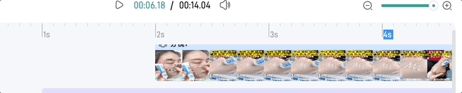

Speaking of images and videos, we often use `img/video` to preview them. However, there are more ways to do this. Today we will introduce some new preview techniques based on frames, such as frame-based video preview, drawing continuous frames over a time, and extract any frame of a gif image.

<!--more-->


## Preview video using long frames
To play a video, we usually use `<video>` tag. However, when we have a page containing hundreds of videos, performance may be a matter if we use `<video>` tag.


In our case, the `div` shows a cover by default. When we move the cursor on it, the `div` shows the current frame by calculating the elapsed time based on cursor's offset. Therefore, when we move quickly, the `div` looks like playing a video.


How to implement this? The initial attempt is to embed a `<video>` tag and set the `currentTime`. Well, it seems a little heavy. Maybe we don't need a real `video`. 

Instead, we use a list of frames extracted from the original video to simulate the play. For example, each frame is `100px*150px` and there are 10 frames in total, so the final image is `100px*1500px`. Wait, why do we stitch the frames vertically? Remember, the screen shows picture by scanning from the left to right and from top to bottom. If the width is too long, it will take much time to render the next line.


```js
function onMouseEnter() {
  if (props.disableLongPicture) return
  
  // download the long image only when mouse enter
  preloadThumbnail()
  
  hasEntered.value = true
}
function onMouseLeave() {
  hasEntered.value = false
}
function onMouseMove(e) {
  if (props.disableLongPicture || !frameDone.value) return

  // threshold = 1      
  const ratio = (e.pageX - wrapLeft + 1) / wrapWidth.value
  const offsetNum = Math.min(props.frameCount - 1, Math.max(0, Math.ceil(ratio * props.frameCount)))
  framePositionStyle.value = {
    'background-position': `0 ${-1 * offsetNum * heightPerFrame.value}px`
  }
  lineStyle.value = {
    left: ratio * wrapWidth.value + 'px',
  }
  currentTime.value = Math.min(duration.value,  Math.max(0, ratio * duration.value))
}
```

## Preview any frame of a gif

工作中遇到一个需求，GIF 默认显示第一帧画面，`hover` 的时候再显示 gif 本身，效果如下


### How

`canvas.drawImage()` 可以提取序列帧，代码实现如下


```ts
function getFirstFrameFromGif(img) {
  const canvas = document.createElement('canvas')
  const ctx = canvas.getContext('2d')  

  canvas.width = img.naturalWidth
  canvas.height = img.naturalHeight
  
  try {
    ctx.drawImage(img, 0, 0, img.naturalWidth, img.naturalHeight)
    return canvas.toDataURL('image/png', 0.75)
  } catch (e) {
    return ''
  }
}
```


### Q1

拿到帧画面了，就需要交替显示图片。一开始是使用 `opacity/display` ，有几个缺点

- 显隐切换会抖动

- 底下的 `gif` 始终在播放，那么 `hover` 的时候，画面不是从头开始播放的

另个方法就是直接换 `src` 


```vue
<div class="gif" @mouseenter="toggleGif" @mouseleave="toggleGif">
  
</div>

function toggleGif() {
  if (!frameSuccess.value) return

  if (gifVisible.value) {
    innerSrc.value = frameSrc.value
  } else {
    innerSrc.value = props.src
  }
  gifVisible.value = !gifVisible.value
}
```

### Q2

这个组件接下来要显示在一个 `div` 里而且是 `cover` 整个容器的效果，但是组件用的 `img` 标签，无法直接用 `background-size: cover`，一个方法是用 `js` 手动算，但是还有更简单的方法，指定 `object-fit`

> The object-fit CSS property sets how the content of a replaced element, such as an `` or `<video>`, should be resized to fit its container. 
> -- MDN


实现代码如下

```css
.gif {
  width: 100%;
  height: 100%;
}
.mogic-gif-frame {
  width: 100%;
  height: 100%;
  
  object-fit: cover;
}
```


### 任意一帧

第一帧是很简单，现在如果想要提取任意时刻的一帧呢？？说实话，几个月之前，我是真不知道的，也就是今天我才在 [MDN](https://developer.mozilla.org/en-US/docs/Web/API/ImageDecoder) 上看到方法，就是用 `ImageCoder` 实现，官方给的例子就可以满足我们的需求。


Step 1 加载图片，实例化解码器

```js
let decoder
fetch(url).then((res) => {
  decoder = new ImageDecoder({
    data: res.body,
    type: 'image/gif',
  })
})
```

Step 2 解析指定位置的帧，渲染到 `canvas`

```js
function main() {
  decoder.decode({
    frameIndex: n,
  }).then(renderFrame)
}

function renderFrame(res) {
  const canvas = document.createElement('canvas')
  const context = canvas.getContext('2d')
  context.drawImag(res.image, 0, 0, canvas.width, canvas.height)
}
```


### Draw GIF on the canvas

既然可以得到任意帧，那么把 GIF 绘制出来，也不是难事，来排个队依次渲染就好了。需要注意的是，这个依次渲染，不是 `0 delay` 的，比如 我们执行一个 `for loop`。
因为渲染1帧也是有时长的，比如我们说帧率 `25fps`，那么绘制一帧需要 `40ms`，也就是说，需要等 `40ms` 后，才能绘制第2桢。

```js
let n = 0
function main() {
  decoder.decode({
    frameIndex: n,
  }).then(renderFrame)
}

function renderFrame(res) {
  // render the nth frame
  const canvas = document.createElement('canvas')
  const context = canvas.getContext('2d')
  context.drawImag(res.image, 0, 0, canvas.width, canvas.height)

  Promise.all([
    // decode the next image ahead
    decoder.decode({
      frameIndex: ++n,
    }),
    // duration for rendering the current frame
    new Promise((resolve) => {
      const delay = res.image.duration / 1000    
      setTimeout(resolve, dealy)
    })
  ]).then(([res, _]) => {
    renderFrame(res)
  })
}
```

上面的代码还是有问题，`n` 会越界从而触发 `RangeError`，要想解决，需要知道这个 `GIF` 总共有多少帧

```js
// get the current image track
const track = decoder.tracks.selectedTrack

if (decoder.complete) {
  // static image
  if (track.frameCount == 1) {
    return
  }

  // rewind
  if (n + 1 >= track.frameCount) {
    n = 0
  }
}
```


## Draw continuous video frames

We often see a series of images (e.g. the below one) shown on the track panel when we use some video editor apps.


To achieve this, we need to solve 

- how to draw a series of images over a period time

- how to draw a series of images over a continuous period time

- how images change when zoom scale changes

### Q1 Extract continuous images

Thanks to [canvas.drawImage](https://developer.mozilla.org/zh-CN/docs/Web/API/CanvasRenderingContext2D/drawImage), we can easily extract any frame from a video.

Suppose we want to extract frames every `250ms` from `0s` to `3s`,

```js
function drawByTime(startTime， endTime, msPerDraw = 250) {
  const frameCount = Math.floor((endTime - startTime) / msPerDraw)

  let beginTime = startTime
  const drawFrame = () => {
    seekTime(beginTime).then(() => {
      const offlineCanvas = document.createElement('canvas')
      offlineCanvas.style.width = frameWidth + 'px'
      offlineCanvas.style.height = frameHeight + 'px'

      offlineCanvas.width = frameWidth 
      offlineCanvas.height = frameHeight

      const ctx = offlineCanvas.getContext('2d')
      ctx!.drawImage(video, 0, 0, frameWidth, frameHeight)

      beginTime = Math.min(endTime, beginTime + msPerDraw)
    })
  }
  for (let count = 0; count < totalFrames; count++) {
    await drawFrame()
  }
}
drawByTime(0, 3000)
```

### Q2 Extract continuous images over a continuous period time

The above solution works if we only draw frames once. What if we have multiple periods? For example, draw images between `0-3s` and `6-10s`. In this case, order matters, i.e. `0-3s` must be drawn first, and then `6-10s` is drawn. Therefore, we need a queue to control the order.


```js
const timeList = [ { startTime: 0, endTime: 3000 }, { startTime: 6000, endTime: 10000 }]
timeList.forEach(async (val) => {
  await drawByTime(val.startTime, val.endTime)
})
```


### Q3 How images change whe scaler changes

So far so good. However, things become difficult when scaler is added. The final effect we want to achieve is shown below.




From the gif, we can see that the frame count becomes smaller/larger when we zoom out/in. In other words, the time of drawing one frame(`msPerDraw`) become longer as we zoom in.

```js
function onScaleChange(ratioIncrease: number) {
  timeList.forEach(async (val) => {
    await drawByTime(val.startTime, val.endTime， 250 / ratioIncrease)
  })
}
```

### Refine

Though the above code works, the performance is not good, especially when we change the scaler. Do you sport the issue? Well, the problem is that every time we zoom in/out, `msPerDraw` will change, causing the unstable currentTime of a video due to this line of code

```js
beginTime = Math.min(endTime, beginTime + msPerDraw)
```

All in all, we are drawing unstable(different) frames because of seeking different currentTime every time we zoom in/out. In fact, it's unnecessary since the precision is not required to be 100% in our business.

A better way is to cache more frames and show them selectively.

- `more frames` means we first cache frames(say `MaxN`) based on the minimum `msPerDraw` (the maximum scaler)

- `show them selectively` means calculate the real frame count (`MaxN*ratio`) as the scaler changes. (Because `MaxN` is the largest frame count, the real frame count can only be smaller than `MaxN`.)

First, we need a queue to cache all frames

```js
const frameList = []

function init() {
  const myFrameQueue = new FrameQueue()
  
  timeList.forEach((val) => {
    myFrameQueue.add(async (_, next) => {
      const frameCount = Math.floor((endTime - startTime) / msPerDraw)
      const tempList: HTMLCanvasElement[] = []
      ....
      for (let count = 0; count < totalFrames; count++) {
        await drawFrame()
      }
      // cached !!!
      frameList.push({
        canvas,
        frameWidth,
        frameHeight,
        list: tempList,
      })

      next()
    })
  })
  
  await myFrameQueue?.run(null, () => {
    myFrameQueue?.destroy()
    renderFrames(scaler)
  })
}
```

To cache and draw frames(`frameList`) in order, we use a common asynchronous control flow patten called  `sequential execution` (we will talk it more in other posts) in `FrameQueue`. The core of this pattern is that the order of execution must be preserved.


```js
class FrameQueue {
  private queue: Array<Function> = []
  
  ...
  
  async run(context?: any, doneCallback?: Function) {
    return new Promise<void>(async (resolve) => {
      let lastIndex = -1

      const step = async (index: number) => {
        if (index == lastIndex) {
          throw new Error('next() called multiple times')
        }

        if (index == this.queue.length) {
          resolve()
          return doneCallback && doneCallback()
        }

        lastIndex = index

        const fn = this.queue[index]

        if (fn) {
          await fn(context, () => {
            step(index + 1)
          })
        }
      }

      await step(0)
    })
  }
}
```

The last step is to render frames based on the current scaler. The default value is `0.5` (the min is 0 and the max is 1)

- calculate the real number of frames to render for each time segment

- select the corresponding frames from `frameList`

- redraw frames on `canvas`

```js
function renderFrames(scaler = 0.5) {
  frameList.forEach((item: any) => {
    const { canvas, list, frameWidth, frameHeight } = item
    
    // step1 the maximum number of frames to render
    const maxFrameNum = list.length
    // at least draw 1 frame
    // the real number of frames to render =  MaxN * ratio
    const totalFrames = Math.max(1, Math.min(maxFrameNum, Math.round(maxFrameNum * scaler)))

    const ctx = canvas.getContext('2d')
    
    // step2
    const step = maxFrameNum / totalFrames
    for (let i = 0; i < totalFrames; i++) {
      const j =  Math.floor(i * step)

      // step 3
      if (list[j]) {
        ctx!.drawImage(
          list[j],
          i * frameWidth * ratio,
          0,
          frameWidth * ratio,
          frameHeight * ratio
        )
      }
    }
  })
}

function onScaleChange(nextScaler: number) {
  renderFrames(nextScaler)
}
```
